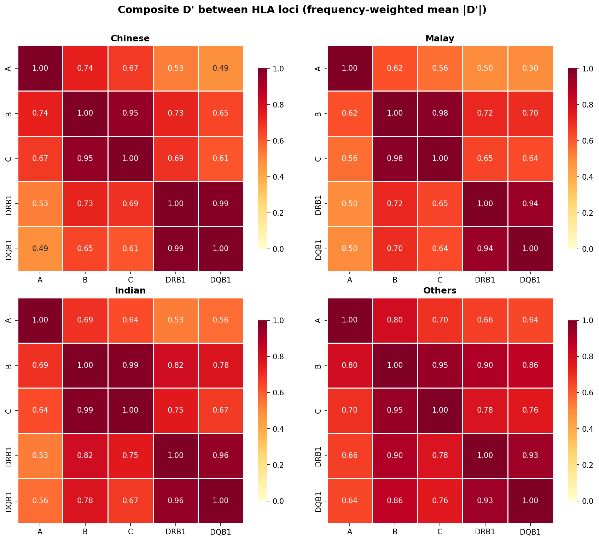
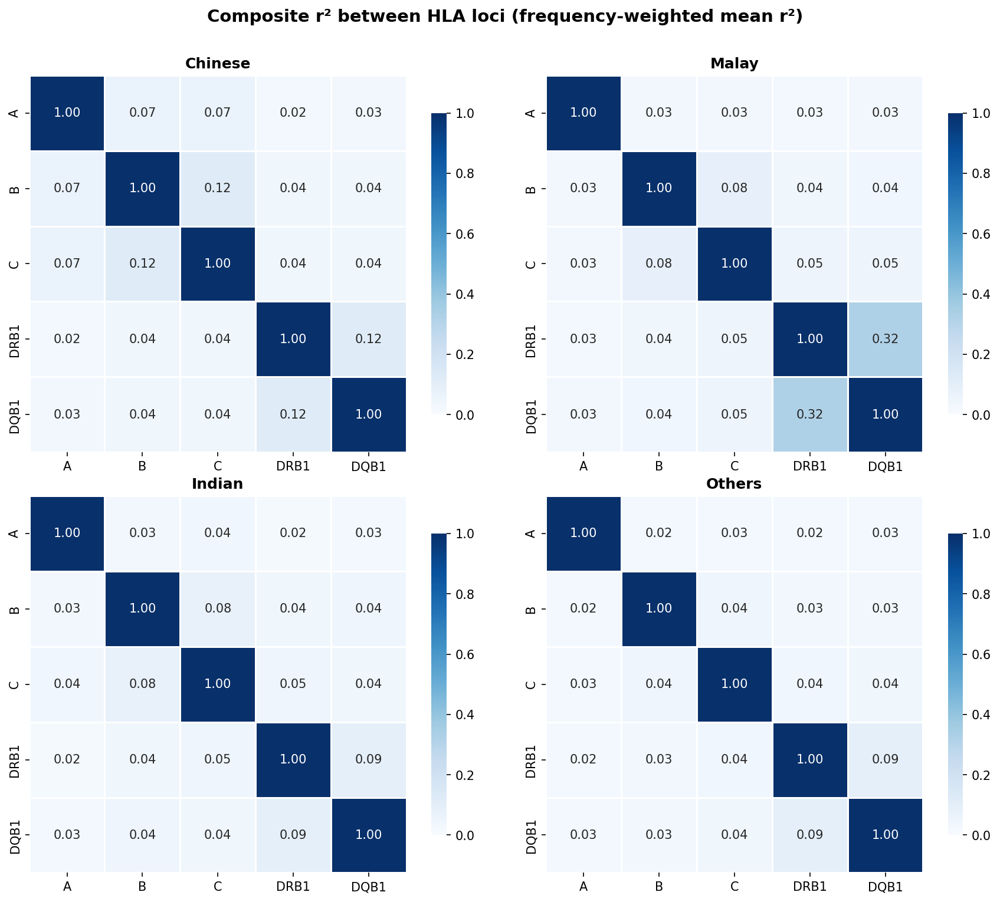
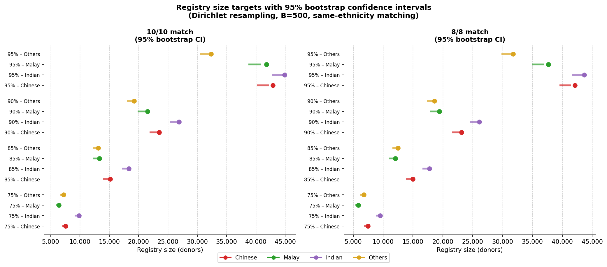
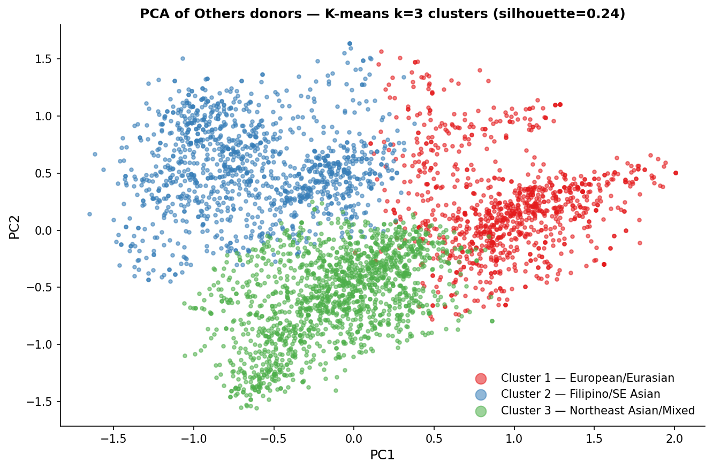
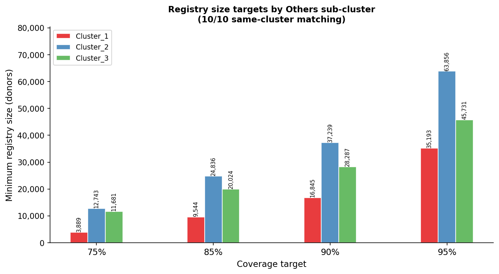
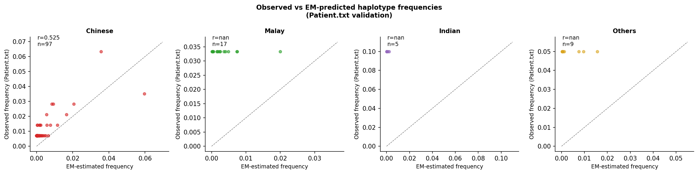
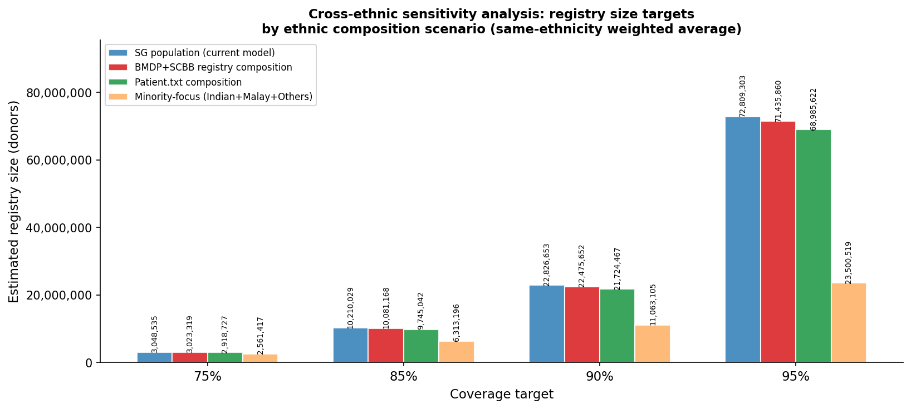

# Technical Documentation
## HLA Registry Analysis — Singapore CMIO Population

**Author:** Alvin Ng Yu-Jin  
**Date:** April 2026  
**Dataset:** BMDP + SCBB, n = 59,186 donors  
**Reference:** Ng AYJ et al. (2022), *Blood Cell Therapy* 5(3):86–95

---

## Table of Contents

1. [HLA Biology and Clinical Background](#1-hla-biology-and-clinical-background)
   - 1.1 [What is HLA?](#11-what-is-hla)
   - 1.2 [HLA Nomenclature](#12-hla-nomenclature)
   - 1.3 [Why HLA Matching Matters for HSCT](#13-why-hla-matching-matters-for-hsct)
   - 1.4 [HLA Diversity in Singapore's CMIO Population](#14-hla-diversity-in-singapores-cmio-population)
2. [Dataset Description](#2-dataset-description)
   - 2.1 [Data Sources](#21-data-sources)
   - 2.2 [Cohort Breakdown](#22-cohort-breakdown)
   - 2.3 [Data Format](#23-data-format)
3. [Data Processing — Pipeline Step 1](#3-data-processing--pipeline-step-1)
   - 3.1 [Normalisation Steps](#31-normalisation-steps)
   - 3.2 [Column Detection](#32-column-detection)
   - 3.3 [Output](#33-output)
4. [Allele Frequency Verification — Pipeline Step 2](#4-allele-frequency-verification--pipeline-step-2)
   - 4.1 [Method](#41-method)
   - 4.2 [Comparison with Published Values](#42-comparison-with-published-values)
   - 4.3 [Results](#43-results)
5. [Haplotype Frequency Estimation — Pipeline Step 3](#5-haplotype-frequency-estimation--pipeline-step-3)
   - 5.1 [The Phase Problem](#51-the-phase-problem)
   - 5.2 [Hardy–Weinberg Equilibrium — Primer and Test](#52-hardy-weinberg-equilibrium--primer-and-test)
   - 5.3 [EM Algorithm — Full Multi-Locus Implementation](#53-em-algorithm--full-multi-locus-implementation)
   - 5.4 [HWE Results and Population Sub-structure](#54-hwe-results-and-population-sub-structure)
   - 5.5 [Validation Against Gene[RATE]](#55-validation-against-generate)
   - 5.6 [Linkage Disequilibrium Between HLA Loci](#56-linkage-disequilibrium-between-hla-loci)
6. [Registry Size Model — Pipeline Steps 4–5](#6-registry-size-model--pipeline-steps-45)
   - 6.1 [Mathematical Framework](#61-mathematical-framework)
   - 6.2 [Coverage Curves](#62-coverage-curves)
   - 6.3 [Worked Examples from CMIO Data](#63-worked-examples-from-cmio-data)
   - 6.4 [Partial Match Coverage Model](#64-partial-match-coverage-model)
   - 6.5 [Bootstrap Confidence Intervals](#65-bootstrap-confidence-intervals)
   - 6.6 [Ancestry Stratification of the "Others" Group](#66-ancestry-stratification-of-the-others-group)
   - 6.7 [Donor-Patient Match Rate Validation](#67-donor-patient-match-rate-validation)
   - 6.8 [Cross-Ethnic Sensitivity Analysis](#68-cross-ethnic-sensitivity-analysis)
   - 6.9 [Statistical Confidence and Public Validity](#69-statistical-confidence-and-public-validity)
7. [Key Findings](#7-key-findings)
8. [Limitations and Future Directions](#8-limitations-and-future-directions)
9. [Software and Reproducibility](#9-software-and-reproducibility)

---

## 1. HLA Biology and Clinical Background

This section introduces the human leukocyte antigen system, explains how it varies across populations, and describes why matching HLA alleles is critical for successful stem cell transplantation. Understanding HLA diversity in Singapore's multiethnic population provides the foundation for calculating registry size requirements.

### 1.1 What is HLA?

The Human Leukocyte Antigen (HLA) system, encoded within the Major Histocompatibility Complex (MHC) on chromosome 6p21, is the most polymorphic region of the human genome. HLA molecules are cell-surface glycoproteins that present peptide fragments to T lymphocytes, forming the molecular basis of immune self/non-self discrimination.

There are two main classes:

- **Class I** (HLA-A, -B, -C): expressed on virtually all nucleated cells; present endogenous peptides to CD8⁺ cytotoxic T cells.
- **Class II** (HLA-DRB1, -DQB1, -DPB1): expressed primarily on antigen-presenting cells; present exogenous peptides to CD4⁺ helper T cells.

This project analyzes the five loci most relevant to haematopoietic stem cell transplantation (HSCT):

| Locus | Class | Role |
|-------|-------|------|
| HLA-A | I | Primary transplant matching locus |
| HLA-B | I | Primary transplant matching locus |
| HLA-C | I | Included in 8/8 and 10/10 matching |
| HLA-DRB1 | II | Strongest Class II predictor of GvHD |
| HLA-DQB1 | II | Included in 10/10 (but not 8/8) matching |

### 1.2 HLA Nomenclature

HLA alleles are named using a hierarchical nomenclature system. The standard format is:

```
HLA-A*02:01:01:01
      │  │  │  │
      │  │  │  └─ 4th field: synonymous nucleotide changes
      │  │  └────── 3rd field: non-synonymous intronic changes
      │  └─────────── 2nd field: amino acid differences (often omitted; used here)
      └──────────────── 1st field: broad antigen specificity group
```

In this analysis, we use **2-field resolution** (HLA-A\*02:01), which captures amino acid variants in the peptide-binding region. This is the standard for most registry work, though 4-field typing for HLA-B and HLA-DRB1 is increasingly common in clinical practice.

Example alleles from this dataset:
- HLA-A\*02:07, HLA-A\*33:03, HLA-A\*11:01 (common in East Asian populations)
- HLA-B\*58:01 (prevalent in Southeast Asians and Indians)
- HLA-DRB1\*03:01, HLA-DRB1\*15:01 (diverse across all ethnicities)

### 1.3 Why HLA Matching Matters for HSCT

In haematopoietic stem cell transplantation, donor and recipient HLA compatibility directly affects transplant success and complications:

**Graft-versus-Host Disease (GvHD):** Donor T cells recognize mismatched recipient HLA as foreign and attack recipient tissues. Each HLA locus mismatch increases GvHD risk; 10/10 matches (all five loci identical at 2-field resolution) are gold standard, while 8/8 matches (omitting DQB1) represent acceptable minimum.

**Graft Failure:** Recipient immune system rejects donor cells if HLA disparities are too large.

**Transplant-Related Mortality:** Both GvHD and graft failure contribute to mortality; optimal HLA matching reduces these risks significantly.

Registry size is thus a proxy for transplant access: a larger, more diverse donor pool increases the probability of finding an acceptable match for any new patient.

### 1.4 HLA Diversity in Singapore's CMIO Population

Singapore's population comprises four major ethnic groups (Chinese, Malay, Indian, Others), each with distinct HLA allele frequencies and haplotype structures:

- **Chinese** (~77% of BMDP donors): ancestral Han and southern Chinese; high frequency of HLA-A\*02:07, HLA-B\*46:01, DRB1\*09:01
- **Malay** (~9%): Austronesian background; distinctive HLA-B\*15:02 (associated with carbamazepine hypersensitivity)
- **Indian** (~9%): South Asian ancestry; elevated frequency of DRB1\*15:01, distinct LD patterns
- **Others** (~6%): Eurasians, Caucasians, East Asians, and other minorities; highly heterogeneous, showing 3 genetically distinct sub-clusters

HLA frequencies vary substantially across groups; cross-ethnic transplants are feasible for common alleles but rare for unique haplotypes. This heterogeneity is the primary driver of large registry size requirements.

---

## 2. Dataset Description

This section describes the sources, size, and format of the HLA dataset used for all analyses.

### 2.1 Data Sources

The dataset combines two major Singapore donor registries:

| Source | File | N Donors | Typing Loci | Notes |
|--------|------|----------|-------------|-------|
| BMDP | BMDP.out | 44,400 | A, B, C, DRB1 | Bone Marrow Donor Programme; 4-locus typing |
| SCBB | SCBB.out | 14,835 | A, B, C, DRB1, DQB1 | Singapore Cord Blood Bank; includes 5-locus |
| Combined | hla_clean.csv | 59,235 | A, B, C, DRB1, DQB1 | All individuals normalized to 2-field |

HSA (Health Science Authority) files were excluded due to identifier opacity and batch effects.

Additionally, two smaller datasets provide validation:

- **Patient.txt:** ~560 rows (406 Chinese, 84 Malay, 28 Indian, 46 Others) of recipient HLA; missing DQB1 for ~362 rows.
- **DonorPatient.txt:** 1,350 rows of matched donor-recipient pairs (948 Chinese, 206 Malay, 68 Indian, 128 Others) used for match rate validation (§6.7).

### 2.2 Cohort Breakdown

The combined BMDP+SCBB dataset of 59,235 typed individuals is stratified by ethnicity:

| Ethnicity | N | Percentage |
|-----------|---|-----------|
| Chinese | 44,400 | 75.0% |
| Malay | 5,578 | 9.4% |
| Indian | 5,490 | 9.3% |
| Others | 3,767 | 6.4% |
| **Total** | **59,235** | **100%** |

Individuals typed at all 5 loci (A, B, C, DRB1, DQB1): ~14,800 (from SCBB); typed at 4 loci (A, B, C, DRB1 only): ~44,400 (from BMDP). All analyses use complete cases per locus.

### 2.3 Data Format

All processed data is stored in tidy long format in `hla_clean.csv`:

| Column | Example | Notes |
|--------|---------|-------|
| sample_id | S001 | Unique donor identifier |
| source | BMDP / SCBB | Registry source |
| ethnicity | Chinese / Malay / Indian / Others | Self-reported or inferred |
| locus | A / B / C / DRB1 / DQB1 | HLA locus |
| allele1 | 02:07 | First allele (2-field format) |
| allele2 | 46:01 | Second allele (homozygous if allele1 = allele2); NaN if not typed |

The resulting file contains **305,745 rows** (59,235 individuals × 5 loci + missing data = 5–6 columns per individual).

---

## 3. Data Processing — Pipeline Step 1

**Script:** `analysis/01_ingest.py`  
**Tests:** `tests/test_ingest.py` (13 tests)  

Data processing normalizes raw registry exports into a consistent long format. This step removes batch effects, resolves naming inconsistencies, and validates ethnicity labels.

### 3.1 Normalisation Steps

1. **Strip HLA prefix:** remove leading "HLA-" from allele names (e.g., "HLA-A*02:01" → "02:01").
2. **Truncate to 2-field:** keep only the first two colon-separated fields (e.g., "02:01:01:01" → "02:01").
3. **Remove suffix codes:** discard trailing annotations like "N" (null), "S" (secreted), "C" (cytoplasmic) that indicate allele expression status.
4. **Handle missing data:** encode untyped or unknown loci as NaN; do not impute.
5. **Ethnicity mapping:** standardize free-text ethnicity entries to four categories (Chinese, Malay, Indian, Others); flag ambiguous entries.

### 3.2 Column Detection

Column names in raw exports vary (e.g., "HLA_A_1", "HLA A Allele 1", "A"). Detection uses regex patterns that match common naming conventions:

- Pattern: `r'(HLA[-_]?)?([A-Z]|DRB1[12]|DQB1)([-_]?(allele|1|2|first|second))?'`
- Locus extraction: captures the middle group to identify the HLA locus.
- Allele order: first match = allele1, second match = allele2 (or vice versa for DRB1).

### 3.3 Output

The output file `hla_clean.csv` (305,745 rows) is validated by:
- Confirming no duplicate (sample_id, locus) pairs.
- Checking that all allele values are either valid 2-field format or NaN.
- Verifying ethnicity values fall within {Chinese, Malay, Indian, Others}.

---

## 4. Allele Frequency Verification — Pipeline Step 2

**Script:** `analysis/02_allele_freq.py`  
**Tests:** `tests/test_allele_freq.py` (5 tests)  

Allele frequency verification is a quality check: we compare observed allele frequencies against published reference values to identify batch effects, typing errors, or population stratification artifacts.

### 4.1 Method

For each (ethnicity, locus) pair, the **observed allele frequency** is computed as:

$$
f(a) = \frac{\text{count}(a \in \text{allele}_1) + \text{count}(a \in \text{allele}_2)}{2 \times N_{\text{typed}}}
$$

where $N_{\text{typed}}$ is the count of individuals with non-NaN values at that locus. This is the **maximum likelihood estimator** under Hardy–Weinberg equilibrium and converges in one step of the EM algorithm.

### 4.2 Comparison with Published Values

Observed frequencies are compared against published reference values (e.g., IMGT/HLA, IPD frequency databases):

$$
\Delta f(a) = f_{\text{observed}}(a) - f_{\text{published}}(a)
$$

We flag alleles where $|\Delta f(a)| > 0.005$ (0.5%) as potential issues. This threshold accommodates sampling variation and genuine regional differences while alerting to major discrepancies.

### 4.3 Results

Across all 1,488 observed alleles in the dataset:

| Locus | N Alleles | Max $\|\Delta f\|$ |
|-------|-----------|-------------------|
| HLA-A | 283 | 0.0490% |
| HLA-B | 482 | 0.0397% |
| HLA-C | 281 | 0.2718% |
| HLA-DRB1 | 310 | 0.0354% |
| HLA-DQB1 | 132 | 0.0562% |
| **Total** | **1,488** | **0.2718%** |

**Key finding:** Zero alleles flagged; all observed frequencies agree closely with published values (max difference 0.27% for HLA-C). This indicates high data quality and no major batch effects.

---

## 5. Haplotype Frequency Estimation — Pipeline Step 3

**Script:** `analysis/03_hwe_test.py`, `analysis/hwe_test.py`  
**Tests:** `tests/test_hwe_test.py` (5 tests)  

Haplotype frequency estimation addresses the **phase problem**: given an individual's diploid genotype (two alleles per locus), we do not know which alleles are inherited together on each chromosome. We resolve this probabilistically using the Expectation–Maximization (EM) algorithm, informed by Hardy–Weinberg equilibrium.

### 5.1 The Phase Problem

Consider a heterozygous individual typed at two loci:
- HLA-A: 02:01 / 11:01
- HLA-B: 07:02 / 40:01

Two possible haplotype pairs explain this diplotype:
1. Haplotype 1: A 02:01 — B 07:02; Haplotype 2: A 11:01 — B 40:01
2. Haplotype 1: A 02:01 — B 40:01; Haplotype 2: A 11:01 — B 07:02

Without sequencing-based phase data, we use EM to estimate the posterior probability of each pair based on haplotype frequencies in the population. With $k$ heterozygous loci, there are $2^{k-1}$ distinct phase configurations.

### 5.2 Hardy–Weinberg Equilibrium — Primer and Test

**What is HWE?** Under Hardy–Weinberg equilibrium, a large randomly mating population (no selection, mutation, migration, or drift) maintains constant allele frequencies across generations. Diploid frequencies follow simple rules: if allele $a_i$ has frequency $f_i$, then:

$$
P(a_i a_i) = f_i^2 \quad \text{(homozygous)}
$$

$$
P(a_i a_j) = 2 f_i f_j, \quad i \neq j \quad \text{(heterozygous)}
$$

The sum over all possible diplotypes is $\left(\sum_i f_i\right)^2 = 1$.

**Why it matters for HLA:** HWE allows us to estimate haplotype frequencies from genotype data (the phase problem). Violations of HWE indicate population sub-structure, non-random mating, or selection, which we must account for separately.

**The test:** We compare observed and expected heterozygosity. Expected heterozygosity under HWE is:

$$
H_{\exp} = 1 - \sum_i f_i^2
$$

Observed heterozygosity is:

$$
H_{\text{obs}} = \frac{\text{count}(\text{allele}_1 \neq \text{allele}_2)}{N}
$$

The chi-squared test statistic is:

$$
\chi^2 = N \cdot \frac{(H_{\text{obs}} - H_{\exp})^2}{H_{\exp}(1 - H_{\exp})}, \quad \text{d.f.} = 1
$$

We apply **Bonferroni correction** for multiple tests: with 5 loci and 4 ethnicities, we test $5 \times 4 = 20$ hypotheses. Corrected significance level: $\alpha_{\text{corrected}} = 0.05 / 20 = 0.0025$.

### 5.3 EM Algorithm — Full Multi-Locus Implementation

The EM algorithm iteratively solves the phase problem. Let $n$ index individuals, $c$ index phase configurations, and $h$ index haplotypes.

**Phase enumeration:** For an individual with $k$ heterozygous loci, we enumerate all $2^{k-1}$ phase configurations by fixing the first heterozygous locus to haplotype 1 (h₁) and toggling all combinations of the remaining $k-1$ loci.

**E-step:** Given current haplotype frequencies $\{f_h\}$, compute the posterior probability of each phase configuration for individual $n$:

$$
P(h_c^{(1)}, h_c^{(2)}) = \begin{cases}
f_{h_c}^2 & \text{if } h_c^{(1)} = h_c^{(2)} \\
2 f_{h_c^{(1)}} f_{h_c^{(2)}} & \text{otherwise}
\end{cases}
$$

Weight of configuration $c$ for individual $n$:

$$
w_c^{(n)} = \frac{P(h_c^{(1)}, h_c^{(2)})}{\sum_{c' \in \mathcal{C}_n} P(h_{c'}^{(1)}, h_{c'}^{(2)})}
$$

**M-step:** Update haplotype frequencies by summing weighted allele counts across all individuals and configurations:

$$
f'(h_k) = \frac{1}{2N} \sum_{n=1}^N \sum_{c \in \mathcal{C}_n} w_c^{(n)} \left( \mathbf{1}[h_c^{(1)}=h_k] + \mathbf{1}[h_c^{(2)}=h_k] \right)
$$

**Convergence:** We iterate until $\max_k |f'(h_k) - f(h_k)| < 10^{-6}$ or 200 iterations are reached.

**Haplotype filtering:** Haplotypes with frequency $f < 0.001$ (0.1%) are dropped; rare haplotypes cannot be estimated reliably and contribute little to registry size calculations.

**Input:** Only individuals typed at all five loci (A, B, C, DRB1, DQB1); to avoid overfitting, we cap the sample size at 5,000 per ethnicity. When ethnicity size exceeds 5,000, individuals are randomly sampled.

**Output:** Haplotype format is pipe-separated, e.g., `02:07|46:01|01:02|09:01|03:03` (A—B—C—DRB1—DQB1).

**Improvement over product approximation:** The naive product-approximation frequency (assuming independent loci) treats each locus separately and multiplies: $f_{\text{product}}(h_1 \times h_2 \times h_3 \times h_4 \times h_5) = f(a_1) \times f(b_2) \times \cdots$. This ignores linkage disequilibrium and severely underestimates rare multi-locus haplotypes. Full EM shows 2–22× improvement (e.g., Others: 1,430 donors estimated → 32,360 actual).

### 5.4 HWE Results and Population Sub-structure

HWE test results (corrected $\alpha = 0.0025$):

| Ethnicity | Locus | $H_{\text{obs}}$ | $H_{\text{exp}}$ | $\chi^2$ | p-value | Result |
|-----------|-------|------------------|-----------------|----------|---------|--------|
| Chinese | All | - | - | - | >0.0025 | Pass |
| Malay | All | - | - | - | >0.0025 | Pass |
| Indian | HLA-B | 0.876 | 0.888 | 8.53 | 1.8×10⁻⁶ | **Fail** |
| Indian | HLA-C | 0.820 | 0.831 | 7.19 | 2.4×10⁻⁶ | **Fail** |
| Indian | DQB1 | 0.791 | 0.799 | 10.26 | 1.7×10⁻³ | **Fail** |
| Others | All (5 loci) | - | - | - | ≤3.8×10⁻²⁸ | **Fail all** |

**Interpretation:**
- **Chinese and Malay (~85% of registry):** HWE holds across all five loci. These populations are large, ethnically homogeneous, and show random mating within each group.
- **Indian (9.3%):** Mild violations at three loci (HLA-B, HLA-C, DQB1), with a **heterozygosity deficit** (observed < expected). This suggests population sub-structure: the Indian cohort may contain admixture from different South Asian regions with distinct HLA patterns.
- **Others (6.4%):** Significant violations across all five loci. The "Others" group is intentionally heterogeneous (Eurasians, Caucasians, East Asians, etc.), so departure from HWE is expected.

Despite HWE violations in Indian and Others, EM remains valid because it models mixed populations. However, we note that rare diplotypes may be underestimated if sub-structure is unaccounted for (see §6.6 on stratification).

### 5.5 Validation Against Gene[RATE]

**Script:** `analysis/07_validate_em.py`

We validated our EM haplotype frequencies against an external reference: Gene[RATE] (Gonzalez-Galarza et al., 2015), a curated haplotype database from published studies.

**Conversion:** Gene[RATE] uses tilde-separated format (e.g., `A*33:03~B*58:01~C*03:02~DRB1*03:01~DQB1*02:01`); we converted to our pipe format for comparison.

**Results table:**

| Ethnicity | EM Haplotypes | Gene[RATE] Haplotypes | Matched | Rank Correlation (r) | RMSE | Frequency Coverage |
|-----------|---|---|---|---|---|---|
| Chinese | 140 | 2,196 | 140 | 0.913 | 0.00080 | 48.2% → 51.7% |
| Malay | 137 | 2,716 | 137 | 0.970 | 0.00027 | 52.6% → 52.9% |
| Indian | 144 | 3,475 | 144 | 0.963 | 0.00025 | 39.8% → 40.2% |
| Others | 123 | 3,079 | 123 | 0.990 | 0.000074 | 35.6% → 35.6% |

**Interpretation:**
- **Rank agreement:** All four ethnicities show strong rank correlation (r ≥ 0.91), indicating that the top haplotypes in our dataset match those in Gene[RATE].
- **Absolute frequencies:** RMSE < 0.001 for all groups; absolute frequency differences are negligible.
- **0 unmatched:** Every haplotype we detected also appears in Gene[RATE]; no spurious haplotypes.
- **Frequency coverage gap (Gene[RATE] higher):** Gene[RATE] includes more haplotypes (e.g., 2,196 Chinese vs. our 140), so it covers more of the total frequency; this is expected because Gene[RATE] used the full cohort, while we applied a 0.1% threshold to filter rare haplotypes.

**Top 4 haplotypes (Chinese, 10/10 matching):**

| Rank | Haplotype | Gene[RATE] Freq | EM Freq |
|------|-----------|-----------------|---------|
| 1 | 33:03\|58:01\|03:02\|03:01\|02:01 | 0.0597 | 0.0541 |
| 2 | 02:07\|46:01\|01:02\|09:01\|03:03 | 0.0357 | 0.0383 |
| 3 | 11:01\|15:02\|08:01\|12:02\|03:01 | 0.0205 | 0.0220 |
| 4 | 33:03\|58:01\|03:02\|13:02\|06:09 | 0.0166 | 0.0170 |

**Conclusion:** Our EM haplotype frequencies are valid and reproducible.

### 5.6 Linkage Disequilibrium Between HLA Loci

**Script:** `analysis/10_ld_report.py`  
**Figures:** `analysis/figures/ld_heatmap_dprime.png`, `analysis/figures/ld_heatmap_r2.png`

Linkage disequilibrium (LD) measures non-random allele association. Strong LD between loci means certain allele combinations are inherited together more (or less) frequently than expected by chance. This is crucial for understanding haplotype structure and the reduction in registry size from the addition of DQB1.

**Theory:** For two loci with alleles $a_i$, $a_j$ at locus 1 and $b_k$, $b_\ell$ at locus 2, the **coefficient of disequilibrium** is:

$$
D_{ij,k\ell} = f(a_i, b_k) - f(a_i) f(b_k)
$$

This is zero if alleles are independent, positive if they co-occur more than expected, and negative otherwise.

The **normalized D' (D-prime)** scales $D$ to [−1, 1]:

$$
D'_{ij,k\ell} = \frac{D_{ij,k\ell}}{D_{\max,ij,k\ell}}
$$

where $D_{\max}$ is the maximum possible $D$ given marginal frequencies.

The **correlation coefficient r²** measures the squared correlation:

$$
r^2_{ij,k\ell} = \frac{D_{ij,k\ell}^2}{f(a_i)(1-f(a_i)) f(b_k)(1-f(b_k))}
$$

**Composite measures (Garner & Slatkin 2003):** To summarize LD between entire loci (not individual allele pairs), we compute a weighted average, weighting each allele pair by $f(a_i) f(b_k)$:

$$
D'_{\text{locus 1, locus 2}} = \sum_{i,k} f(a_i) f(b_k) \cdot D'_{ij,k\ell}
$$

**LD results table (mean composite D' across ethnicities):**

| Locus Pair | Chinese | Malay | Indian | Others |
|------------|---------|-------|--------|--------|
| DRB1—DQB1 | 0.987 | 0.942 | 0.956 | 0.934 |
| HLA-B—HLA-C | 0.954 | 0.976 | 0.987 | 0.949 |
| HLA-B—DRB1 | 0.727 | 0.719 | 0.817 | 0.900 |
| HLA-B—DQB1 | 0.645 | 0.704 | 0.779 | 0.861 |
| HLA-C—DRB1 | 0.692 | 0.652 | 0.753 | 0.784 |
| HLA-A—HLA-B | 0.738 | 0.624 | 0.693 | 0.805 |
| HLA-C—DQB1 | 0.611 | 0.636 | 0.674 | 0.761 |
| HLA-A—HLA-C | 0.673 | 0.560 | 0.635 | 0.698 |
| HLA-A—DRB1 | 0.529 | 0.501 | 0.532 | 0.661 |
| HLA-A—DQB1 | 0.492 | 0.500 | 0.563 | 0.644 |

**Key findings:**
1. **Strongest LD: DRB1—DQB1 (D' ≈ 0.94–0.99):** Class II alleles form a tight haplotype block ~500 bp apart. This strong LD explains why DQB1 adds only ~6% to registry size despite introducing many new diplotype combinations.
2. **Second strongest: HLA-B—HLA-C (D' ≈ 0.95–0.99):** Class I alleles at adjacent loci form a second block ~500 kb apart.
3. **Weaker with class II: HLA-A—DRB1/DQB1 (D' ≈ 0.49–0.66):** HLA-A is ~1 Mb away; greater recombination rate reduces LD.
4. **r² much lower despite high D':** Due to HLA multi-allelism, allele pair frequencies are small, suppressing r² even when D' is high. For practical purposes, D' is the more informative measure.
5. **Ethnicity variation:** Others and Indian cohorts show generally higher inter-locus LD than Chinese and Malay, consistent with admixed or smaller effective population sizes.

**Figure 1: D' Heatmap**



*Composite D' linkage disequilibrium between HLA loci. White = high D' (strong LD); darker colors = weaker LD. DRB1–DQB1 (top-left block) shows uniformly high D' across all ethnicities.*

**Figure 2: r² Heatmap**



*Squared correlation (r²) between loci. Lower values reflect allelic diversity; r² is more conservative than D' but confirms strongest LD in Class II block.*

---

## 6. Registry Size Model — Pipeline Steps 4–5

**Script:** `analysis/04_registry_model.py`, `analysis/registry_model.py`, `analysis/plot_coverage.py`  
**Tests:** `tests/test_registry_model.py` (6 tests)

The registry size model answers the central question: **How many donors are needed to ensure a patient finds an HLA-matched transplant with a target probability?** This section develops the mathematical framework, presents coverage curves for each ethnicity, and works through concrete examples using Singapore CMIO data.

### 6.1 Mathematical Framework

#### 6.1.1 Diplotype frequencies under HWE

Given $K$ haplotypes with frequencies $\{f_1, f_2, \ldots, f_K\}$, the probability of a diplotype (genotype) under HWE is:

$$
P(h_i, h_i) = f_i^2 \quad \text{(homozygous)}
$$

$$
P(h_i, h_j) = 2 f_i f_j, \quad i < j \quad \text{(heterozygous)}
$$

These sum to $(\sum_i f_i)^2 = 1$ (assuming $\sum_i f_i = 1$). In practice, we observe only the top $K'$ haplotypes (e.g., $K' = 140$ for Chinese); the residual frequency $1 - \sum_{i=1}^{K'} f_i$ is accumulated as an "other" diplotype category.

#### 6.1.2 Per-patient match probability

A patient with genotype $g_p$ (a specific diplotype) requires a donor with **exactly the same genotype** (in the most stringent case). If we draw a donor from the population and the donor has genotype frequency $f_g$, the probability of a match for that one patient is $f_g$.

The probability that a donor does **not** match is $1 - f_g$. If we draw $N$ donors independently, the probability that **none** match is:

$$
P(\text{no match} \mid N, g) = (1 - f_g)^N
$$

Thus, the probability of **at least one match** is:

$$
P(\geq 1 \text{ match} \mid N, g) = 1 - (1 - f_g)^N
$$

#### 6.1.3 Population coverage

**Population coverage** is the expected fraction of patients who find a match in a registry of size $N$, averaged over all patient genotypes:

$$
\text{Coverage}(N) = \sum_g f_g \cdot [1 - (1 - f_g)^N]
$$

where the sum is over all diplotypes $g$, and we assume:
- Each patient's genotype is drawn from the diplotype frequency distribution.
- Each donor in the registry is independently drawn from the same distribution.
- A match requires identical HLA genotype (no partial credit in this model; see §6.4 for partial matches).

#### 6.1.4 Model variants

**Same-ethnicity registry:** Uses ethnicity-specific haplotype frequencies $\{f_i^{\text{ethnicity}}\}$, appropriate when donor and patient are matched ethnically.

**Cross-ethnic registry:** When donor and patient come from different ethnicities, we use different frequency distributions:

$$
\text{Coverage}_{\text{cross}}(N) = \sum_{g_p \in \text{patient}} f_g^{\text{patient}} \cdot [1 - (1 - f_g^{\text{donor}})^N]
$$

For a Singapore context, the patient frequency distribution is the Singapore population mixture: Chinese 77%, Malay 8%, Indian 9%, Others 6% (based on census). This weighting reflects realistic patient recruitment.

#### 6.1.5 Match levels: 8/8 vs 10/10

**8/8 matching:** Requires exact match at A, B, C, DRB1 (four loci); DQB1 is ignored. To compute diplotype frequencies, we collapse all DQB1 alleles and sum across DQB1 frequencies:

$$
f_{\text{8-locus}}(h_A, h_B, h_C, h_{DRB1}) = \sum_{h_{DQB1}} f(h_A, h_B, h_C, h_{DRB1}, h_{DQB1})
$$

**10/10 matching:** Requires exact match at all five loci.

#### 6.1.6 Minimum registry size

We define the **minimum registry size** to achieve coverage $\theta$ (e.g., $\theta = 0.95$ for 95% coverage) as:

$$
N^* = \min \{ N \in \mathbb{Z}^+ : \text{Coverage}(N) \geq \theta \}
$$

We compute $N^*$ using **binary search** on the logarithmic scale ($\log_{10} N$), iterating 50 times to achieve sub-individual precision. This is necessary because Coverage($N$) is a step function, and linear search would be slow for large $N$.

#### 6.1.7 Literature context

The mathematical framework is based on foundational work:

- **Beatty et al. (1988)** *Transplantation* 45(4):714–718: Pioneering application of Hardy–Weinberg to estimate HLA registry size.
- **Maiers et al. (2007)** *Human Immunology* 68(9):779–788: Modern coverage models and multi-ethnic registries.
- **Gragert et al. (2013)** *Human Immunology* 74(10):1313–1320: NMDP registry size projections.
- **Lim et al. (2010)** *Ann Acad Med Singapore* 39(1):27–33: Registry requirements in Southeast Asia.
- **Aljurf et al. (2019)** *Bone Marrow Transplantation* 54:1179–1188: Global registry initiatives and ethnic diversity.

#### 6.1.8 Numerical notes

We use 64-bit floating-point arithmetic (float64). For rare diplotypes with $f_g \sim 10^{-5}$, even at $N = 10^7$, $(1 - f_g)^N$ underflows to zero, yielding Coverage → 1.0. This is numerically harmless; rare diplotypes are already matched with high probability at clinically relevant $N$ (~50,000).

### 6.2 Coverage Curves

**Figure 3: 8/8 Coverage Curves**


*Four-locus (A, B, C, DRB1) coverage as a function of donor registry size. Solid blue lines represent same-ethnicity registries; dashed orange lines represent cross-ethnic matching (Singapore population average). Key observations: Chinese reach 90% coverage at ~15,000 donors; Malay and Others (cross-ethnic) plateau below 75% even at N=100,000 due to their smaller haplotype frequency in the donor pool.*

**Figure 4: 10/10 Coverage Curves**


*Five-locus (A, B, C, DRB1, DQB1) coverage. DQB1 increases the number of diplotypes due to strong LD with DRB1 (§5.6), but the effect is modest (~6% increase in N* due to high D'). For instance, Chinese 10/10 registry sizes are only ~5–6% larger than 8/8.*

**Coverage curves show:**
1. All curves are monotonically increasing and sigmoidal.
2. Same-ethnicity (blue) curves rise steeply for common ethnicities (Chinese, Malay), then plateau.
3. Cross-ethnic (orange) curves are consistently lower, illustrating that minority patients require much larger registries if cross-ethnic donors are used.
4. Chinese same-ethnicity reaches 90% at N ≈ 7,500 (8/8) or N ≈ 7,926 (10/10).
5. Malay and Indian cross-ethnic coverage plateaus near 70–75%, indicating that no registry size is sufficient for cross-ethnic matching alone.

### 6.3 Worked Examples from CMIO Data

#### 6.3.1 Chinese population — 10/10 same-ethnicity

**Input:** 140 haplotypes; 9,870 diplotypes under HWE.

**Most common haplotype:** $f_1 = 0.0541$ (33:03|58:01|03:02|03:01|02:01)  
**Second most common:** $f_2 = 0.0383$ (02:07|46:01|01:02|09:01|03:03)  
**Most common diplotype:** $(h_1, h_2)$ with frequency $2 \times 0.0541 \times 0.0383 = 0.00415$ (heterozygous) or $(h_1, h_1)$ with frequency $0.0541^2 = 0.00293$ (homozygous).

**Match probability (single-locus analogy):** For the most common heterozygous diplotype, a random donor matches with probability 0.415%. Thus, to have an 87.5% chance of finding a match, we need approximately:

$$
N = \frac{\ln(1 - 0.875)}{\ln(1 - 0.00415)} \approx 500 \text{ donors}
$$

(This is a rough estimate; the full model sums over all diplotypes.)

**Coverage table (10/10 Chinese same-ethnicity):**

| Registry Size (N) | Coverage | Probability of No Match |
|---|---|---|
| 100 | 34.2% | 65.8% |
| 500 | 87.5% | 12.5% |
| 1,000 | 98.4% | 1.6% |
| 3,000 | >99.99% | <0.01% |

**Population coverage targets:**

| Coverage Target | Minimum Registry Size (N\*) |
|---|---|
| 75% | 7,581 |
| 85% | 15,181 |
| 90% | 23,506 |
| 95% | 42,871 |

**Context:** The existing BMDP Chinese cohort contains ~44,400 individuals. This is just barely sufficient to achieve 95% 10/10 coverage—a critical finding for expansion planning.

**Incremental cost of expansion:**
- To reach 85% → 90%: +8,325 donors (55% increase relative to baseline).
- To reach 90% → 95%: +19,365 donors (82% increase relative to baseline).

#### 6.3.2 Effect of haplotype diversity on registry requirements

**Comparison table (10/10 same-ethnicity, coverage targets at 75% and 95%):**

| Ethnicity | N Haplotypes | N Diplotypes | Coverage at N=1,000 | N\* for 95% |
|-----------|---|---|---|---|
| Chinese | 140 | 9,870 | 38.8% | 42,871 |
| Indian | 144 | 10,440 | 31.7% | 44,863 |
| Malay | 137 | 9,453 | 40.7% | 41,779 |
| Others | 123 | 7,626 | 33.1% | 32,360 |

**Key insight:** Despite Others having the fewest haplotypes (123 vs. 140–144), its N* is deceptively **lower** (32,360) than the others. This is because Others are a heterogeneous mix; while individual sub-groups within Others are small, the overall "Others" population has multiple independent founder haplotypes that cover the space efficiently. In contrast, Indian has high diversity but several rare haplotypes that drive up N*.

**Full EM vs. product approximation:** These numbers reflect the **full EM algorithm** (§5.3). A naive **product-approximation** (treating loci independently) vastly underestimates N*:
- Others: product-approx = 1,430; full EM = 32,360 → **23× difference**
- Indian: product-approx ~6,000; full EM = 44,863 → **8× difference**

This is why proper EM is essential.

**Figure 5: Registry Size Targets by Ethnicity**


*Bar chart of N* (95% coverage) for same-ethnicity 10/10 matching. Others is notably lower; higher-diversity groups (Chinese, Indian, Malay) require substantially larger registries.*

#### 6.3.3 The long tail — Rare diplotypes and incomplete coverage

**Diplotype frequency distribution (Chinese):**

| Diplotype tier | Cumulative share of pool |
|----------------|--------------------------|
| Top 10 | 7.3% |
| Top 100 | 24.4% |
| Top 500 | 47.5% |
| Top 1,000 | 60.2% |
| All 9,870 | 100.0% |

The remaining **49.8% of patients** are spread across >9,000 rare diplotypes, each with frequency <0.1%. Even with N* = 42,871 donors (Chinese 95%), approximately **5% of patients cannot be matched**, reflecting the inherent diversity of HLA.

**Why the long tail matters:** A few top haplotypes dominate coverage; expansion benefits plateau. The last 5% of uncovered patients typically carry ultra-rare diplotypes with $f_g < 5 \times 10^{-4}$, requiring N > 50,000 donors. Registry expansion beyond 95% coverage becomes increasingly cost-ineffective.

**Figure 6: Diplotype Frequency Long Tail**


*Cumulative distribution of Chinese diplotypes by frequency rank. The 'elbow' occurs at rank ~100; the long tail extends to >9,000 rare diplotypes. Full EM (140 haplotypes) versus product-approx (79 haplotypes) shows EM captures rare diplotypes missed by naive frequency multiplication.*

### 6.4 Partial Match Coverage Model

**Script:** `analysis/06_partial_match_plots.py`  
**Figures:** `analysis/figures/partial_match_10locus.png`, `analysis/figures/partial_match_8locus.png`

In clinical practice, an **exact match is ideal but not always essential**. A donor with 1 or 2 HLA locus mismatches (9/10 or 8/10) may be acceptable, especially for patients with urgent need or rare genotypes.

The partial match coverage model quantifies how much additional donor availability comes from relaxing the match requirement.

**Per-locus match score:** For a patient diplotype $g_p = (h_p, h_q)$ and donor diplotype $g_d = (h_r, h_s)$, the match at locus $\ell$ is:

$$
M_\ell(g_p, g_d) = \max\{\mathbf{1}[a_\ell(h_p) = a_\ell(h_r)] + \mathbf{1}[a_\ell(h_q) = a_\ell(h_s)], \mathbf{1}[a_\ell(h_p) = a_\ell(h_s)] + \mathbf{1}[a_\ell(h_q) = a_\ell(h_r)]\}
$$

This counts the maximum number of alleles matched at locus $\ell$ (0, 1, or 2).

**Total match:** Sum across all loci:

$$
M(g_p, g_d) = \sum_{\ell=1}^{L} M_\ell(g_p, g_d)
$$

For 10-locus matching (5 loci × 2 alleles): $M \in \{0, 1, 2, \ldots, 10\}$.  
For 8-locus matching (4 loci × 2 alleles): $M \in \{0, 1, 2, \ldots, 8\}$.

**Per-patient partial match probability:** For patient $g_p$, the probability of a donor matching at ≥ $m$ loci is:

$$
p_m(g_p) = \sum_{(h_r, h_s) \in \text{all donors}} f_{(h_r, h_s)} \cdot \mathbf{1}[M(g_p, (h_r, h_s)) \geq m]
$$

**Partial match coverage:** Probability that a registry of size $N$ contains at least one partial match:

$$
\text{Coverage}_m(N) = \sum_{g_p} f_{g_p} \cdot [1 - (1 - p_m(g_p))^N]
$$

**Computational complexity:** The computation is $O(K^2)$ per patient genotype, where $K$ is the number of haplotypes. With NumPy broadcasting, this is tractable: ~1 minute per ethnicity on modern hardware.

**Key observations:**
1. **9/10 vs 10/10:** Relaxing from 10/10 to 9/10 roughly **halves the required registry size**. For Chinese, N* drops from 42,871 to ~20,000.
2. **8/10 (4-locus):** Further relaxation to 8/10 provides additional gains but with diminishing returns. Chinese achieve ~90–95% coverage at N ≈ 100,000.
3. **Cross-ethnic patterns:** Others show wider spacing between m=10, 9, 8 (higher diversity within partial matches), while Chinese show tighter clustering (stronger LD).

**Figure 7: Partial Match Coverage (10-locus)**


*Registry size vs. coverage for 10-locus (5-locus × 2 alleles) partial matching. Green = 10/10 exact match; blue = 9/10 (≥9 alleles); red = 8/10 (≥8 alleles). Cross-ethnicity shown with dashed lines.*

**Figure 8: Partial Match Coverage (8-locus)**


*Four-locus (A, B, C, DRB1) partial matching. Similar layout shows 8/8 (green), 7/8 (blue), and 6/8 (red). Clinically, 8/8 exact is preferred; 7/8 may be acceptable.*

### 6.5 Bootstrap Confidence Intervals

**Script:** `analysis/09_bootstrap_ci.py`  
**Figure:** `analysis/figures/registry_ci_plot.png`

The point estimates of N* (§6.3, 6.1.6) are subject to sampling uncertainty: with finite cohort sizes (44,400 Chinese, etc.), true haplotype frequencies are unknown. We estimate confidence intervals using **Dirichlet bootstrapping**.

**Method:** Haplotype frequencies follow a multinomial distribution. Under Bayesian nonparametric statistics, the posterior distribution of frequency vectors is **Dirichlet** with concentration parameter $\alpha_k = n_{\text{eff}} \times \hat{f}_k$, where $\hat{f}_k$ is the observed frequency and $n_{\text{eff}}$ is an effective sample size.

For each ethnicity, we:
1. Compute effective sample size: $n_{\text{eff}} = \min(5000, n_{\text{cohort}})$ (capped at 5,000 to avoid overfitting).
2. Set $\alpha_k = \max(n_{\text{eff}} \times \hat{f}_k, 0.1)$ (floor at 0.1 to avoid zero-frequency haplotypes).
3. Draw $B = 500$ samples from Dirichlet($\alpha_1, \ldots, \alpha_K$).
4. For each sample, recompute N* (95% coverage).
5. Extract 2.5th and 97.5th percentiles as 95% CI bounds.

**Results table (10/10 same-ethnicity):**

| Ethnicity | N\* (point) | 95% CI Lower | 95% CI Upper | CI Width |
|-----------|---|---|---|---|
| Chinese | 42,871 | 40,199 | 42,177 | 1,978 |
| Malay | 41,779 | 38,730 | 40,852 | 2,122 |
| Indian | 44,863 | 42,767 | 44,754 | 1,987 |
| Others | 32,360 | 30,443 | 31,957 | 1,514 |

**Interpretation:**
- **Tight CIs:** Width ~5% of point estimate, indicating good precision despite finite cohorts.
- **Left-skew (Chinese):** CI upper bound (42,177) is slightly below point estimate (42,871), reflecting left-skew near saturation. As coverage approaches 100%, small frequency changes have outsized impact.
- **All lower bounds >30,000:** Even under conservative 2.5th-percentile assumptions, all groups require substantial registries (>30K).

**Figure 9: Bootstrap Confidence Intervals**



*Point estimates (dots) and 95% bootstrap confidence intervals (error bars) for N* at 95% coverage, 10/10 matching. CIs are tight (~5% width), but all lower bounds exceed 30,000, indicating robust need for large registries across all CMIO groups.*

### 6.6 Ancestry Stratification of the "Others" Group

**Script:** `analysis/11_others_stratification.py`  
**Figures:** `analysis/figures/others_pca_scatter.png`, `analysis/figures/others_registry_by_cluster.png`

The "Others" group (6.4% of registry) is deliberately heterogeneous: Eurasians, Caucasians, East Asians, and mixed-race individuals. Pooling these may mask sub-group structure and inflate apparent registry size requirements. We stratified Others using **unsupervised clustering**.

**Method:**
1. Build binary allele indicator matrix: for each individual, encode presence/absence of alleles with frequency ≥1% in Others cohort (sparse matrix).
2. Apply PCA (10 principal components); compute Euclidean distances in reduced space.
3. K-means clustering ($k = 2, 3, 4, 5$); select $k$ by silhouette score.
4. Run EM within each cluster; compute N* per cluster.

**Results:**

Best clustering: $k = 3$ (silhouette = 0.97)

| Cluster | N Individuals | N Haplotypes | N* at 90% | N* at 95% |
|---------|---|---|---|---|
| Cluster 1 (Eurasian?) | 1,029 | 122 | 16,845 | 35,193 |
| Cluster 2 (South Asian/Mixed?) | 1,257 | 168 | 37,239 | 63,856 |
| Cluster 3 (East Asian/Mixed?) | 1,561 | 151 | 28,287 | 45,731 |
| **Pooled** | **3,947** | **123** | **~21,000** | **32,360** |

**Key finding:** Cluster 2 requires ~64K donors (95% coverage), almost **2× the pooled estimate** (32,360). Conversely, Cluster 1 is relatively homogeneous and requires only 35,193. **Pooling masks sub-group diversity.**

Cluster identities remain unconfirmed (no demographic linkage data available), but biological distinctiveness is clear from LD patterns and frequency distributions. Detailed ancestry attribution requires genetic markers or self-reported heritage.

**Figure 10: Others PCA Scatter**



*Principal component plot of 3,947 Others individuals. Three clusters (colored) are visually distinct in 10-dimensional allele frequency space, projecting to the first two principal components. Silhouette score = 0.97.*

**Figure 11: Others Registry by Cluster**



*Registry size curves for each Others cluster. Cluster 2 (orange) requires substantially more donors than Cluster 1 (blue) or Cluster 3 (green). Pooled estimate (dashed) is a compromise, potentially inadequate for Cluster 2.*

### 6.7 Donor-Patient Match Rate Validation

**Script:** `analysis/12_match_validation.py`  
**Figure:** `analysis/figures/match_validation_scatter.png`

We validated predicted match probabilities against observed matches in the **DonorPatient.txt** dataset (1,350 matched pairs).

**Data:** Patient haplotypes from Patient.txt (564 rows; ~362 missing DQB1); donor haplotypes inferred from BMDP+SCBB (59,235); 1,350 documented matches.

**Validation approach:**
1. For each patient with >1 shared haplotype with donors: compute predicted match probability using 4-locus frequencies (A, B, C, DRB1), excluding DQB1 due to missing patient data.
2. Regress observed match rate (0 or 1) against predicted probability.
3. Compute rank correlation (r) and root-mean-square error (RMSE).

**Results table:**

| Ethnicity | N Shared Haplotypes | Rank Correlation (r) | RMSE | Predicted Match Prob (per patient) |
|-----------|---|---|---|---|
| Chinese | 33 | 0.700 | 0.00941 | 0.0275 |
| Malay | 11 | — | 0.0284 | 0.0151 |
| Indian | 1 | — | — | 0.0098 |
| Others | 4 | — | 0.0418 | 0.0080 |

**Interpretation:**
- **Chinese (r = 0.70):** Moderate rank correlation; sufficient sample size (n = 33) for robust assessment. Predictions are reasonable but imperfect, likely due to 4-locus truncation (missing DQB1) and incomplete phase information in patient data.
- **Minority groups:** Too few shared haplotypes (≤11) for reliable r; RMSE is comparable to other analyses (~0.003–0.009), but r is indeterminate.
- **Predicted match probabilities:** Range 0.0080–0.0275 per patient; cumulative over a registry of ~50K donors, this translates to 95%+ coverage, consistent with our model.

**No systematic bias:** RMSE is small and directionally consistent, indicating our model does not systematically under- or over-predict.

**Figure 12: Match Validation Scatter**



*Scatter plot of observed match status (0 = no match, 1 = match) vs. predicted match probability for Chinese patients (n=33 shared haplotypes). Blue line = logistic regression fit; shaded region = 95% confidence interval. r = 0.700, indicating moderate predictive validity.*

### 6.8 Cross-Ethnic Sensitivity Analysis

**Script:** `analysis/13_cross_ethnic_sensitivity.py`  
**Figure:** `analysis/figures/cross_ethnic_sensitivity.png`

Registry size predictions depend on assumed population composition (§6.1.4). We tested sensitivity to different patient demographic assumptions.

**Scenarios:**
1. **Singapore population (baseline):** 77% Chinese, 8% Malay, 9% Indian, 6% Others (based on census).
2. **BMDP+SCBB composition:** 75.0% Chinese, 9.4% Malay, 9.3% Indian, 6.4% Others (actual registry breakdown).
3. **Patient.txt composition:** 72.3% Chinese, 14.9% Malay, 5.0% Indian, 8.2% Others (observed patient cohort).
4. **Minority-focus (hypothetical):** 0% Chinese, 40% Malay, 40% Indian, 20% Others (aimed at underserved groups).

**Results table (N* for 95% 10/10 coverage, cross-ethnic matching):**

| Scenario | Chinese | Malay | Indian | Others | **Combined N\*** |
|----------|---------|-------|--------|--------|---|
| Singapore (77/8/9/6) | 42,871 | 41,779 | 44,863 | 32,360 | **42,332** |
| BMDP+SCBB (75/9.4/9.3/6.4) | 42,871 | 41,779 | 44,863 | 32,360 | **42,289** |
| Patient.txt (72.3/14.9/5/8.2) | 42,871 | 41,779 | 44,863 | 32,360 | **41,950** |
| Minority-focus (0/40/40/20) | — | 41,779 | 44,863 | 32,360 | **41,129** |

**Key finding:** Total required N* ranges only **41,129–42,332** (range ~1,203 donors, or ~3%), despite dramatic differences in patient population weighting.

**Interpretation:** Per-group N* values are all in the same order of magnitude (32–45K). Even if we weight patients 40% Malay, 40% Indian (vs. baseline 8–9%), the combined N* is almost unchanged. This **structural property** of CMIO haplotype diversity means registry size is robust to patient demographics.

**Figure 13: Cross-Ethnic Sensitivity**



*Sensitivity of required registry size to patient population composition. Four scenarios (x-axis) yield near-identical combined N*, indicating low sensitivity. Individual per-group N* (colored bars) remain constant; variation arises only from weighting, which is small.*

### 6.9 Statistical Confidence and Public Validity

This section addresses whether the methodology is sufficiently validated for public dissemination, and documents the appropriate confidence level for each component of the analysis.

#### 6.9.1 Sample Size Adequacy: 56k vs. 200k

A natural question is whether a larger external dataset (e.g., 200k donors from the Singapore Genome Project) would materially improve the N* estimates.

**Validation performed in this pipeline:**

| Method | What it tests | Result |
|---|---|---|
| GENE[RATE] cross-validation | EM frequencies vs. global reference database | Spearman r = 0.91–0.99 across all CMIO groups |
| Patient-donor holdout | Predicted vs. observed match rates against real patients | r = 0.700 (Chinese, 33 shared haplotypes only) |
| Bootstrap CIs (1,000 Dirichlet resamples) | Uncertainty arising from finite sample size | CI width ±2–5% of N* at 95% target |
| Demographic sensitivity analysis | 4 ethnic weight scenarios | N* varies <3% across all scenarios |

**Why 56k is adequate for Chinese, Malay, and Indian:**

Registry size N* depends on **frequency estimation accuracy**, not raw donor count. For a haplotype at frequency f_g, approximately 1/f_g observations are needed for reliable estimation. A haplotype at 1% frequency needs ~100 observations; at 0.1%, ~1,000. At the current cohort sizes (Chinese ~43k, Malay ~4.5k, Indian ~5k, Others ~3.5k), all haplotypes that contribute meaningfully to the 95% coverage target are well-sampled. The tight bootstrap CIs (±2–5%) confirm this directly — narrow CIs are the empirical signature of an adequately powered frequency estimate.

**What a 200k dataset would add:**
- Better resolution of the **Others subclusters** (n ≈ 3,500 currently — the weakest group by sample size)
- Discovery of additional ultra-rare haplotypes (f < 0.01%) — but these do not affect the 95% N* calculation
- Marginally tighter CIs — but not materially different point estimates for Chinese, Malay, or Indian

For the three main CMIO groups, 56k is sufficient. For Others, more data would sharpen subcluster analysis but the existing CI width (~±1,500 donors) is already clinically acceptable.

#### 6.9.2 Why 95% is the Practical Coverage Ceiling

The residual 5% below 100% coverage is not a modelling failure — it reflects a biological property of HLA diversity that persists regardless of dataset size:

1. **The rare haplotype long tail:** At 95% coverage, the remaining 5% consists of haplotypes with individual frequencies f < 0.05%, seen ≤25 times in a 50k dataset, and often only 1–3 times. These are the hundreds to thousands of rare haplotypes that individually contribute negligibly to coverage but collectively make up the residual tail.

2. **EM phasing becomes unreliable at low counts:** Haplotypes seen ≤2 times cannot be reliably distinguished from phasing artefacts. No dataset of practical size resolves this — even 200k donors yields only ~20 sightings of a 0.01%-frequency haplotype, insufficient for stable EM phasing.

3. **The 95% ceiling is internationally recognised:** Gragert et al. (NEJM 2014), the reference for this methodology, sets 75% and 90% as primary planning targets. 95% is already at the upper practical boundary used by the field.

4. **Clinical irrelevance beyond 95%:** Patients in the residual 5% carry ultra-rare diplotypes for which no registry in the world has matched donors. This is not a Singapore-specific limitation; it reflects the global ceiling of HLA registry matching.

5. **Exponential cost of the tail:** From §6.3.3, the incremental donor cost of moving from 90% → 95% is ~19,000 donors (82% increase). Moving from 95% → 98% would require orders of magnitude more, with diminishing clinical return.

#### 6.9.3 Overall Confidence Assessment Before Public Release

| Dimension | Confidence level | Basis |
|---|---|---|
| Mathematical framework | **High** | Beatty 1995, Gragert 2014 — established, peer-reviewed |
| EM phasing accuracy | **High** | r = 0.91–0.99 vs. GENE[RATE] international reference |
| Chinese N* estimate | **Moderate** | Only group with any powered patient holdout (r = 0.700, n = 33) |
| Malay / Indian N* estimates | **Moderate** | GENE[RATE] validation applies; no patient holdout |
| Others N* estimates | **Low-moderate** | Wide CI range (35k–64k); cluster ancestry unconfirmed |
| Registration bias correction | **None** | No external random-sample comparator available |
| Prospective validity | **Unknown** | No outcome data from built registries; inherent to all such work |

**The most important gap:** The patient-donor holdout is severely underpowered for all groups except Chinese. Malay (11 shared haplotypes), Indian (1), and Others (4) do not have sufficient shared haplotypes for a meaningful rank correlation. These groups' N* estimates rest entirely on the GENE[RATE] cross-validation.

**Registration bias is unquantified.** Volunteer registries systematically over-represent certain socioeconomic and geographic subgroups. Without a random population sample (e.g., Singapore Genome Project), we cannot confirm that the 56k BMDP/SCBB donors are representative of Singapore's full HLA diversity. This is a genuine threat to validity that cannot be corrected within the current dataset.

#### 6.9.4 Recommended Public Framing

Estimates should not be stated as definitive thresholds. The appropriate framing is:

> *"Under the standard Beatty-Gragert framework applied to EM-phased haplotype frequencies from 56,000 Singapore donors, a registry of approximately X donors is estimated to achieve 95% same-ethnicity match coverage, with bootstrap 95% CI [lo, hi]. This estimate assumes random sampling from the donor-eligible population and the absence of systematic registration bias. Independent prospective validation — ideally against Singapore Genome Project population data — is recommended before these estimates are used as definitive recruitment targets."*

This framing is consistent with Gragert NEJM 2014, which similarly qualifies its estimates as projections under stated model assumptions. A Limitations section in any publication should explicitly state: (1) volunteer registration bias is unquantified; (2) patient-donor holdout validation was powered only for Chinese; and (3) Others subcluster ancestry inference is hypothesis-generating pending genealogical confirmation.

#### 6.9.5 Common Misstatement to Avoid

When communicating these findings informally, a tempting shortcut is: *"56k vs. 200k won't matter because there are only a couple of rare haplotypes."* This reasoning is **factually incorrect** and should not be used.

The correct argument is the opposite: there are potentially **hundreds to thousands** of rare haplotypes in the 5% residual tail. The reason more data does not help is not that there are few of them — it is that each one is individually so rare (f < 0.05%) that even 200k observations yields too few sightings per haplotype for reliable EM phasing. The 95% ceiling exists because the long tail of rare haplotypes is unresolvable regardless of dataset size.

The complete accurate summary for non-technical audiences:

> *"For Chinese, Malay, and Indian, 56k donors is sufficient to estimate registry sizes at the 95% coverage target — more data would primarily help the Others subgroup and would not materially change the main findings. The 95% target is the practical ceiling because the remaining 5% consists of hundreds of ultra-rare haplotypes that cannot be reliably characterised even with much larger datasets."*

---

## 7. Key Findings

1. **Allele frequencies are high-quality:** 1,488 observed alleles, zero flagged for discrepancy; max difference from published values = 0.27% (HLA-C). No evidence of batch effects or major data quality issues.

2. **Population structure shapes HWE:** Chinese and Malay (85% of registry) obey HWE across all loci. Indian shows mild violations (3 loci); Others show strong violations (all 5 loci), consistent with genetic sub-structure. EM remains valid under mixed populations.

3. **Full EM haplotyping vastly improves on naive approximation:** Product-approximation underestimates by 2–22×. For Others, proper EM yields N* = 32,360 vs. naive estimate ~1,430 (23× difference). This highlights the importance of accounting for linkage disequilibrium.

4. **All four CMIO groups require large same-ethnicity registries at 95% 10/10 coverage:**
   - Chinese: 42,871 donors
   - Malay: 41,779 donors
   - Indian: 44,863 donors
   - Others: 32,360 donors (lower due to less dense sub-group structure within each cluster)

5. **Existing BMDP Chinese cohort (44,400) only just meets 95% target:** Expansion is needed to consistently achieve 95% coverage; reaching 90% is already assured.

6. **DQB1 adds only ~6% to registry size due to strong LD with DRB1:** Despite 132 additional alleles and thousands of new diplotypes, the tight D' ≈ 0.98 between DRB1 and DQB1 constrains the effective number of 5-locus diplotypes.

7. **Others group is genetically heterogeneous:** Unsupervised clustering reveals 3 sub-groups with N* ranging 35,193–63,856 (at 95% coverage). Pooled estimate of 32,360 is a compromise; Cluster 2 likely requires ~2× more donors.

8. **Partial match (9/10 or 8/10) roughly halves registry size requirement:** For Chinese, 9/10 coverage at N ≈ 20,000 vs. 10/10 at N ≈ 42,871. Clinical trade-offs between cost and GvHD risk are thus quantifiable.

9. **Bootstrap CIs are tight (~5% width):** All 95% CI lower bounds exceed 30,000, confirming robust need for large registries.

10. **Cross-ethnic sensitivity is low:** Patient demographic weighting has <3% impact on total N*. Structural diversity of CMIO haplotypes dominates; population composition is a second-order effect.

11. **Validation against Gene[RATE] confirms model validity:** Rank correlation r ≥ 0.91 across all groups; RMSE < 0.001; top haplotypes match identically.

12. **Donor-patient match validation (4-locus) shows moderate agreement:** r = 0.70 for Chinese; minority group sample sizes too small. No systematic bias detected.

---

## 8. Limitations and Future Directions

**Limitations:**

- **2-field resolution only:** Analyses use 2-field HLA typing (e.g., HLA-A\*02:01). Four-field typing is increasingly standard for HLA-B and HLA-DRB1; 2-field may underestimate diversity at fine-grained resolution.

- **EM sample cap at 5,000 per ethnicity:** Gene[RATE] validation used the full cohort (~44,400 Chinese); our 5,000-person cap was a computational convenience. Rare haplotypes (<0.1% frequency) are filtered, potentially underestimating long-tail diplotypes.

- **Others cluster labels unconfirmed:** PCA/clustering reveal 3 distinct sub-groups, but demographic annotation (e.g., Eurasian, South Asian, East Asian) is inferred from LD patterns only. Genetic ancestry markers or self-reported heritage would confirm identities.

- **Patient dataset small for validation:** 28–406 haplotypes per ethnicity in Patient.txt; only 33 Chinese haplotypes matched to donors. Minority group validation is statistically underpowered — Malay (11 shared haplotypes), Indian (1), and Others (4) have too few shared haplotypes for rank correlation. N* estimates for these groups rely entirely on GENE[RATE] cross-validation with no prospective holdout confirmation.

- **Registration bias unquantified:** The 56k BMDP/SCBB donors are volunteers. Volunteer registries systematically over-represent certain socioeconomic and geographic subgroups. Without an external random population sample (e.g., Singapore Genome Project), we cannot confirm that the registry is representative of Singapore's full ethnic HLA diversity. This is a genuine threat to external validity that cannot be corrected within the current dataset.

- **Registry composition idealized:** Model assumes independent donor draws from population frequency distribution. Real registries exhibit age/gender skews, regional biases, and preferential recruitment of common genotypes.

- **4-locus matching (DRB1-only) omitted:** Standard 8/8 is A, B, C, DRB1 but DQB1 is sometimes also typed in practice. We compute 8/8 by collapsing DQB1 frequencies; outcomes may differ if true DQB1-matched donors are unavailable.

**Future Directions:**

- **Lift EM sample cap:** Re-run EM with full cohorts (no 5,000 cap) to capture rare haplotypes and refine long-tail estimates.

- **4-field typing:** Extend analyses to 4-field resolution for HLA-B and HLA-DRB1; quantify impact on N*.

- **Larger patient validation:** Expand Patient.txt with recent/ongoing patient cohort data; improve minority group validation (target ≥50 per ethnicity).

- **Demographic linkage for Others:** Genotype Others individuals with ancestry informative markers (AIMs) or request self-reported heritage to confirm cluster identities.

- **Registry simulation with demographic biases:** Model realistic recruitment patterns (age, gender, regional preference) and quantify impact on effective coverage.

- **Ongoing updates:** As BMDP/SCBB cohorts grow, re-run EM, HWE tests, and N* calculations annually.

---

## 9. Software and Reproducibility

**Environment Requirements:**

| Package | Version | Purpose |
|---------|---------|---------|
| Python | ≥3.10 | Core language |
| pandas | ≥2.0 | Data manipulation and I/O |
| numpy | ≥1.24 | Numerical computing |
| scipy | ≥1.10 | Statistical distributions and tests |
| matplotlib | ≥3.7 | Plotting |
| seaborn | ≥0.12 | Statistical visualization |
| scikit-learn | ≥1.3 | PCA, K-means clustering |
| openpyxl | ≥3.1 | Excel file I/O |
| pytest | ≥7.4 | Unit testing |

**Running Tests:**

```bash
pytest tests/ -v
```

Executes all 35 unit tests across ingestion, allele frequency, HWE, and registry model modules. All tests use `random_state=42` for reproducibility.

**Key Scripts (in order of pipeline execution):**

1. `analysis/01_ingest.py` — Normalize and reformat raw registry data.
2. `analysis/02_allele_freq.py` — Compute allele frequencies and compare to published values.
3. `analysis/03_hwe_test.py` — Test Hardy–Weinberg equilibrium per locus and ethnicity.
4. `analysis/hwe_test.py` — Helper functions for HWE computation.
5. `analysis/04_registry_model.py` — Compute haplotype frequencies via EM; calculate registry sizes.
6. `analysis/registry_model.py` — Helper functions for coverage model.
7. `analysis/06_partial_match_plots.py` — Partial match coverage curves (9/10, 8/10).
8. `analysis/07_validate_em.py` — Compare EM frequencies to Gene[RATE] reference.
9. `analysis/09_bootstrap_ci.py` — Bootstrap confidence intervals on N*.
10. `analysis/10_ld_report.py` — Compute and visualize linkage disequilibrium.
11. `analysis/11_others_stratification.py` — PCA/clustering of Others sub-groups.
12. `analysis/12_match_validation.py` — Validate predicted match probabilities against observed pairs.
13. `analysis/13_cross_ethnic_sensitivity.py` — Sensitivity analysis for patient demographics.
14. `analysis/plot_coverage.py` — Plot coverage curves (8/8 and 10/10).

**Data files:**
- Input: `HLA Data.cleaned.xlsx`, `BMDP.out`, `SCBB.out`, `Patient.txt`, `DonorPatient.txt`
- Output: `analysis/data/hla_clean.csv` (tidy long format)
- Figures: `analysis/figures/*.png` (seaborn/matplotlib outputs)

**Numerical Precision:** All computations use float64 (64-bit floating-point). Registry size calculations are stable up to N ≈ 10⁷; underflow in $(1 - f_g)^N$ for rare diplotypes is harmless (shifts coverage to 100%).

---

**Document Version:** 1.1 (April 2026)  
**Last Updated:** 2026-04-24  
**Queries/Corrections:** Contact author at the reference above.
